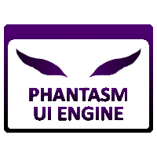

	

<h1 align="center">Phantasm UI Engine</h1>
The Phantasm UI Engine is a system created for Roblox games which intends to make it much easier for UI to be created whilst also separating the requirement that the UI designer needs to be a programmer and allowing them to make the UI while the programmer can make the UI functional later with ease.

## Features
- Components
- Functions
- Bindings
- Themes
- State Animations/Animations
- State Sounds
- Editor Plugin (WIP, not yet completed.)
